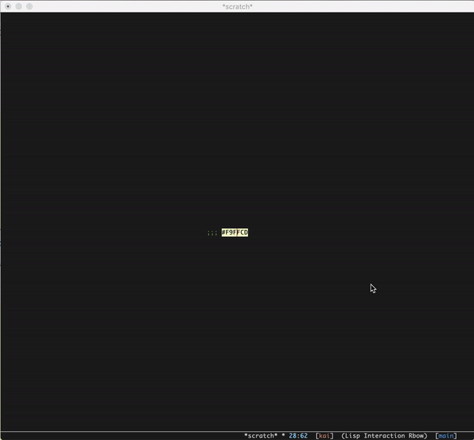

# Introduction

"yanse" is the chinese pronunciation of "颜色" which represents "color".

# Usage

Currently, it provides three commands:

- `yanse-cycle`: cycle between color formats.
- `yanse-rgb-to-hex` and `yanse-hex-to-rgb`: convert between `rgb(red, green, blue)` and hex format.
- `yanse-rgb-to-hsl` and `yanse-hsl-to-rgb`: convert between `rgb(red, green, blue)` and `hsl(hue, saturation, lumen)`.
- `yanse-hex-to-hsl` and `yanse-hsl-to-hex`: convert between hex format and `hsl(hue, saturation, lumen)`.

You may notice that there may be some errors when conversion. Such as, after
several conversions, `#123456` would be `#123354`. That is because Emacs `round`
function is platform-dependent:

> Rounding a value equidistant between two integers may choose the
> integer closer to zero, or it may prefer an even integer, depending on
> your machine.  For example, (round 2.5) can return 3 on some
> systems, but 2 on others.
